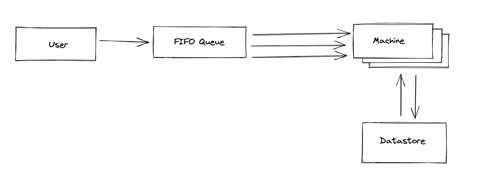

# Serverless XState

Running xstate on serverless functions.

## Why?

AWS Step functions are cool and allow you to build state machines, but they are difficult to setup for processes that are meant to wait for some external signal like a request from a user.

Consider how we would deploy a "user signup machine" with AWS Step Functions. The part where we wait for the user to verify their email address can happen after some non-trivial amount of time. 

This is solved by what AWS terms "manual approval steps", steps in the workflow that can be approved/declined from the outside. This feels rather tacked on to me and doesn't support the full power of state machines. For example what if there are more than success and fail transitions from a state node? I'm not sure if this is even possible with step functions (please correct me)!

This doesn't begin to comment on other drawbacks of using step functions such as lock in and tooling.

What if we want to use a proper language (TypeScript) with proper tooling (xstate)?

## How?

This is where it gets a little tricky. XState isn't designed (at the time of writing) for this use case. We need to solve a few problems:

- In order to run an XState machine in a lambda, we need a way of pausing and continuing the machine on arbitrary state nodes
- To do this, we need to serialise the state somewhere
- Before we can pause a machine, we must wait for any async services to complete
- Concurrent events need to be queued

These four problems are elegantly solved in [this great Durable Entities example](https://github.com/davidkpiano/durable-entities-xstate) but we don't all have the pleasure of working in an Azure environment and until AWS releases a Durable Entities alternative, we must find a different way.

### Pausing

There are a couple of ways to do this. [One approach I've seen](https://github.com/davidkpiano/durable-entities-xstate/issues/1) is to start interpreting the machine and wait for any services to end. In pseudocode:

```
service = interpret(machine)
while (service.state.services.length > 0) {
  sleep()
}

return service.currentState
```

Let's call this a polling strategy. I'm sure this could work, but right now I'm tending towards something more declarative.

In our machine, there are points where we must yield to the user or other external systems. These points, if we design our machine well, will be state nodes in our chart that represent when our machine is in a "settled" state. By definition they will have no services attached.

From any node in our machine, we can interpret the machine until we reach one of these "settled" nodes. At which point we know the machine isn't going to transition any further right now and end the execution.

We can mark these nodes as settled using some metadata eg. [Tags](https://xstate.js.org/docs/guides/statenodes.html#tags). This has the added benefit of being able to see at a glance when your machine is waiting for an external event, and when it's in the middle of processing internal ones. These nodes are boundaries where the machine can receive events from the outside world, it's quite nice to be explicit about this!

### Serialising state

Now we have a way of pausing the machine, we need a way of continuing it. The nodes we mark as "settled" offer convenient places from which we can serialise our state, we can save it to some datastore each time we enter one.

Then when we receive a new external event we can hydrate the state from the datastore, begin execution, and wait to reach the next settled node.

### Handling concurrent events

While our machine is in an un-settled (🥲) state we must make sure not to accept any new events. Doing so could easily cause race conditions where two concurrent threads of execution will read and write the state to our datastore.

We can solve this by putting some sort of FIFO queue in front of our machine. Each time we reach a settled node we can dequeue the next event and begin executing once again. In an AWS serverless design, this could be an SQS FIFO queue using different message group IDs for each machine instance.

### The whole design



- **The User** - sends event to a FIFO queue eg. AWS SQS
- **FIFO Queue** - holds events that are waiting to be picked up by a machine
- **Machine** - is a serverless function that is executed from an event in the queue
- **Datastore** - is where a machine retrieves it's initial state when it starts executing, and where it persists the state when it reaches a settled node

## Running

Doesn't actually run on a lambda right now, maybe soon

```
npm i
npm run start
```
